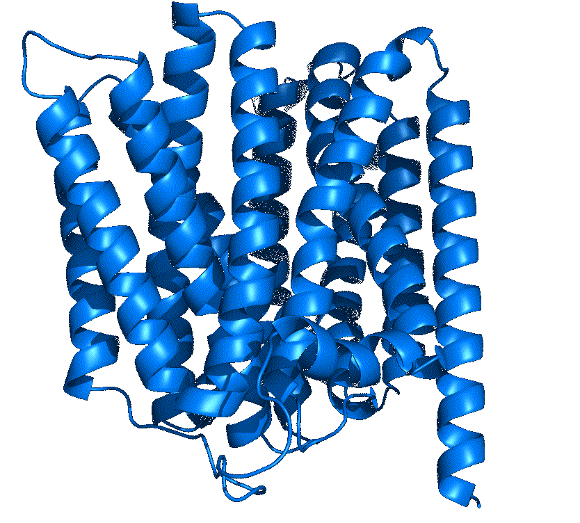
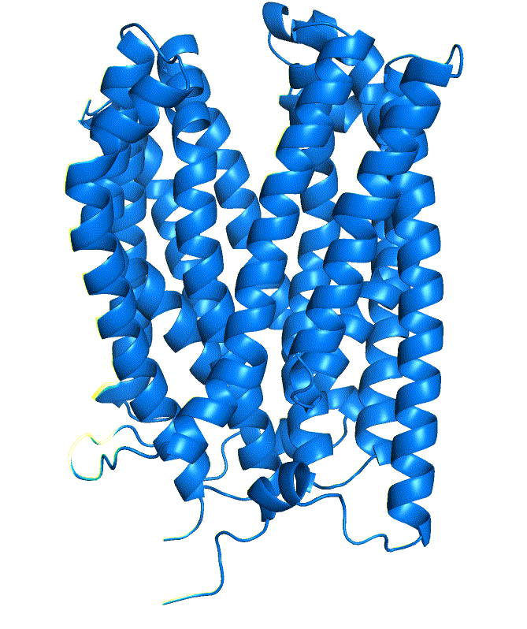
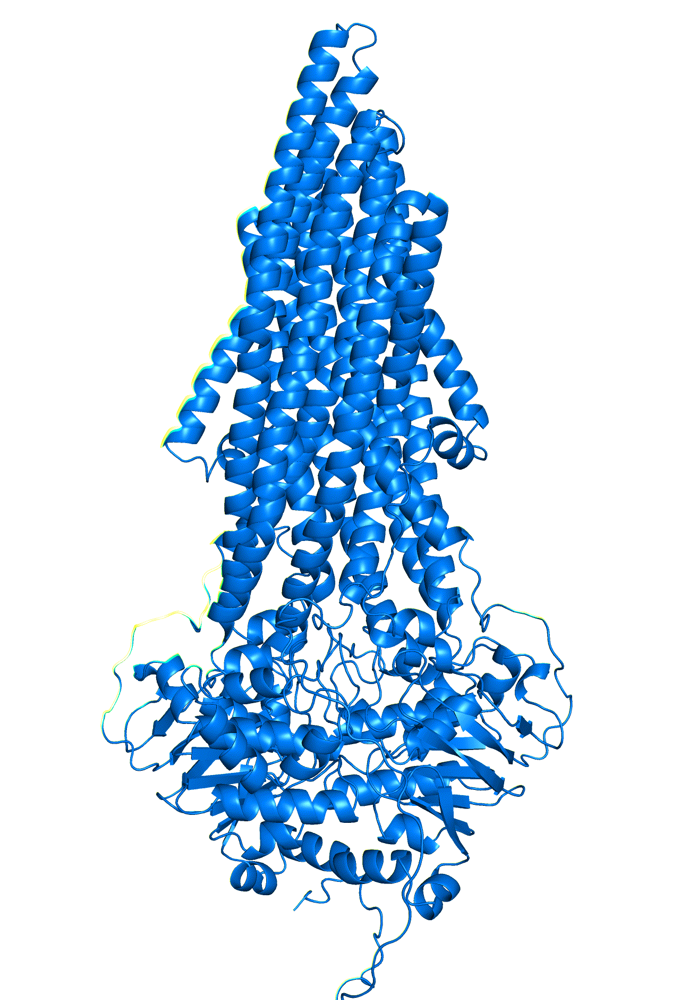

# DEERFold

### Description
In this work, we introduce DEERFold, a modified AlphaFold2 framework that incorporates distance  distributions from Double Electron-Electron Resonance (DEER) spectroscopy into protein structure prediction. DEERFold generates accurate and diverse protein conformations guided by experimental and simulated distance distributions, outperforming base AlphaFold2 for proteins with limited homologs to generate multiple conformational states. Critically, DEERFold reduces the number of required experimental constraints, increasing throughput and expanding capabilities beyond DEER to other probe-based methods. We envision DEERFold will advance protein structure prediction by bridging the gap between experimental data and deep learning techniques, enabling more accurate and efficient conformational modeling.

DEERFold is described in this [preprint](https://doi.org/10.1101/2024.10.30.621127); if you use the code from this repository or the results, please cite the preprint.

<p align="center">

</p>

<p align="center">
  
  
  
</p>

## Table of contents

- [DEERFold](#deerfold)
- [Installation](#installation)
    - [Available DEERFold models](#available-deerfold-models)
- [Inference](#inference)
  - [Unconstrained prediction](#unconstrained-prediction) 
  - [Constrained prediction](#constrained-prediction)
- [Training](#training)
  - [MSA Dataset](#msa-dataset) 
  - [Protein Structure Dataset](#protein-structure-dataset) 
  - [DEERFold Training Data](#deerfold-training-data) 
  - [DEER Data Generation](#deer-data-generation) 

----

## Installation
We provide a notebook with installation guidance that can be found in <mark>[examples/deerfold.ipynb](https://github.com/CAAIPD/DEERFold/tree/main/examples/deerfold.ipynb)</mark>. It also includes examples on how to generate predictions using our models. We recommend following this notebook if you would like to use our models to generate proteins.

### **Available DEERFold models**
* ``` DEERFold.pt: DEERFold model trained on exposed sites in both helical and beta strand regions  ```

Model weights can be downloaded [here](https://zenodo.org/records/14032036) as DEERFold.tar.gz.

## Inference
### Unconstrained prediction

For comparison DEERFold can accept empty csv file to genreate unconstrained models. 

To unconditionally generate models from DEERFold, run the following script:

``` 
python deerfold_inference.py <fasta_file> <msa_dir> <out_dir> --model <model_weights_dir> --neff neff --num num

E.g. Generate 15 unconstrained DEERFold models, set MSA Neff as 5
python deerfold_inference.py examples/PfMATE_A.fasta examples/alignments out/PfMATE --model model/DEERFold.pt --neff 5 --num 15
```
Options are as follows:
- `fasta_file`: Input sequence file in FASTA format.
- `msa_dir`: Directory containing multiple sequence alignments.
- `out_dir`: Directory to save output models.
- `model`: Directory storing all the model weights.
- `neff`: MSA Neff value.
- `num`: Number of models to generate.

An example of unconstrained model generation from DEERFold can be found in
[this notebook](https://github.com/CAAIPD/DEERFold/tree/main/examples/deerfold.ipynb).

### Constrained prediction
DEERFold can accept input DEER distance constraints in csv format, the format is shown as below:
```
18,95,0,0,0,0,2.00E-05,7.00E-05,0.00027,0.0009,0.0027,0.00708,0.01622,0,0,0,0,...
18,215,0,0,0,0,0,0,8.00E-05,0.000940009,0.007260073,0.035440354,0.109791098,0.215792158,0.269092691,0.212892129,0.106851069,...
18,240,0,0,1.00E-05,4.00E-05,0.000169995,0.00067998,0.00233993,0.006879794,0.017259482,0.036938892,0.067427977,0.10499685,0.139475816,0.158035259,0.152745418,...
```
The input distance constraints are in the format of distograms (shape LxLx100, each bin, except for the first and last, spans 1 Å and is centered at integer values from 1 to 99 Å. The first bin includes all values up to and including 1.5 Å, while the last bin captures all values above 99.5 Å).

To run inference on a sequence with the given DEER constraints, run the following script:
```
python deerfold_inference.py <fasta_file> <msa_dir> <out_dir> --model <model_weights_dir> --splabel <csv_file> --neff neff --num num --ref_pdbs <ref1.pdb,ref2.pdb>

Options are:
- `fasta`: Input sequence file in FASTA format.
- `splabel`: Input file with DEER constraints in CSV format.
- `msa_dir`: Directory containing multiple sequence alignments.
- `out_dir`: Directory to save output models.
- `models`: Directory storing all the model weights.
- `neff`: MSA Neff value.
- `num_models`: Number of models to generate.
- `ref_pdbs`: Reference PDB files for RMSD and TM-score analysis (optional).
```
* E.g. Generate 15 constrained models from DEERFold_helix based on the input DEER constraints(**--splabel** examples/PfMATE/PfMATE_low.csv), set MSA Neff as 5
```
python deerfold_inference.py examples/PfMATE/PfMATE_A.fasta examples/alignments out/PfMATE --splabel examples/PfMATE/PfMATE_low.csv --neff 5 --num 15
```
* E.g. If you have the reference models available, DEERFold provides RMSD and TM-score analysis of the prediction results compared to the reference PDB files(**--ref_pdbs**).
```
python deerfold_inference.py examples/PfMATE/PfMATE_A.fasta examples/alignments out/PfMATE --splabel examples/PfMATE/PfMATE_low.csv --neff 5 --num 15 --ref_pdbs examples/PfMATE/6gwh.pdb,examples/PfMATE/6fhz.pdb
```

Outputs should be DEERFold predicted models in the format of PDB files, which are ranked by EMD distance between the prediction and the input distance constraints. **The top ranking models should be those most closely fitting the input distance constraints.**

An example of constrained model generation from DEERFold can be found in
[this notebook](https://github.com/CAAIPD/DEERFold/tree/main/examples/deerfold.ipynb).

## Training
### MSA Dataset
To train the model, you will first need to download the Multiple Sequence Alignments (MSAs) are from the [OpenFold dataset](https://registry.opendata.aws/openfold/), 
which contains 401,381 MSAs for 140,000 unique Protein Data Bank (PDB) chains and 16,000,000 UniClust30 clusters.

### Protein Structure Dataset
The correspond protein strucures are extracted from [OpenFold dataset](https://registry.opendata.aws/openfold/) and denoted as `mmcif_dir`.

### DEERFold Training Data
The filenames for train and validation DEERFold splits are saved in `data/train.json` and `data/val.json`

### DEER Data Generation
DEER data used for training can be downloaded [here](https://zenodo.org/records/14032036). Or you can generate the simulation data in csv file by chiLife for the protein structure in the format of mmCIF file, which the labeling sites are selected by the method [Kazmier et al.](https://www.sciencedirect.com/science/article/abs/pii/S1047847710003400?via%3Dihub). 

**Step 1** Generate the simulated DEER data in csv file from the protein structure in the format of mmCIF file.

<mark>Install DSSP first:</mark> 
```
conda install -c salilab dssp
conda install libboost==1.73.0
```
```
python scripts/generate_DEER_data.py <mmcif_file> <chain_id> <helix_cufoff> <strand_cutoff> <out_dir>

E.g.
python scripts/generate_DEER_data.py examples/PfMATE/6fhz.cif A 20 5 out/

Outputs: 6fhz_A.csv  6fhz_A.json  6fhz_A.pdb
6fhz_A.csv: Output simulated DEER data in csv format.
6fhz_A.json: Mapping of residue names to their indexes in the selected chain.
6fhz_A.pdb: The selected chain structure in pdb format.
```
Options are:
- `mmcif_file`: Input structure file in cif format.
- `chain_id`: Chain id.
- `helix_cutoff`: Selecting labeling sites for helix segments >= cutoff (default : 20).
- `strand_cutoff`: Selecting labeling sites for beta strand segments >= cutoff (default : 5).
- `out_dir`: Directory to save outputs.

### Loading Pretrained Alphafold2 Models
The model was fine-tuned using AlphaFold2's pretrained model weights without using templates ([model_5_ptm](https://storage.googleapis.com/alphafold/alphafold_params_2022-01-19.tar)), which was previously released versions of AlphaFold and AlphaFold-Multimer were trained using PDB structures with a release date before 2018-04-30, a cutoff date chosen to coincide with the start of the 2018 CASP13 assessment. 

### Finally, call the training sript:

The training procedure mainly follows the Openfold training procedure. For more details, please check [Openfold](https://github.com/aqlaboratory/openfold/blob/main/docs/source/original_readme.md) for instructions. 
```
python train_openfold.py <train_mmcif_dir> <train_alignment_dir>  <out_dir> --val_data_dir <val_mmcif_dir> --val_alignment_dir <val_alignment_dir> --checkpoint_best_val=True  --precision bf16 --gpus 4 --replace_sampler_ddp=True --seed 4242022 --obsolete_pdbs_file_path obsolete.dat  --train_mapping_path data/train.json --deepspeed_config_path deepspeed_config.json --wandb --wandb_project deerfold
```

### Citation
```
@article {Wu2024.10.30.621127,
	author = {Wu, Tianqi and Stein, Richard A. and Kao, Te-Yu and Brown, Benjamin and Mchaourab, Hassane S.},
	title = {Modeling Protein Conformations by Guiding AlphaFold2 with Distance Distributions. Application to Double Electron Electron Resonance (DEER) Spectroscopy},
	elocation-id = {2024.10.30.621127},
	year = {2024},
	doi = {10.1101/2024.10.30.621127},
	publisher = {Cold Spring Harbor Laboratory},
	eprint = {https://www.biorxiv.org/content/early/2024/11/01/2024.10.30.621127.full.pdf},
	journal = {bioRxiv}
}
```
